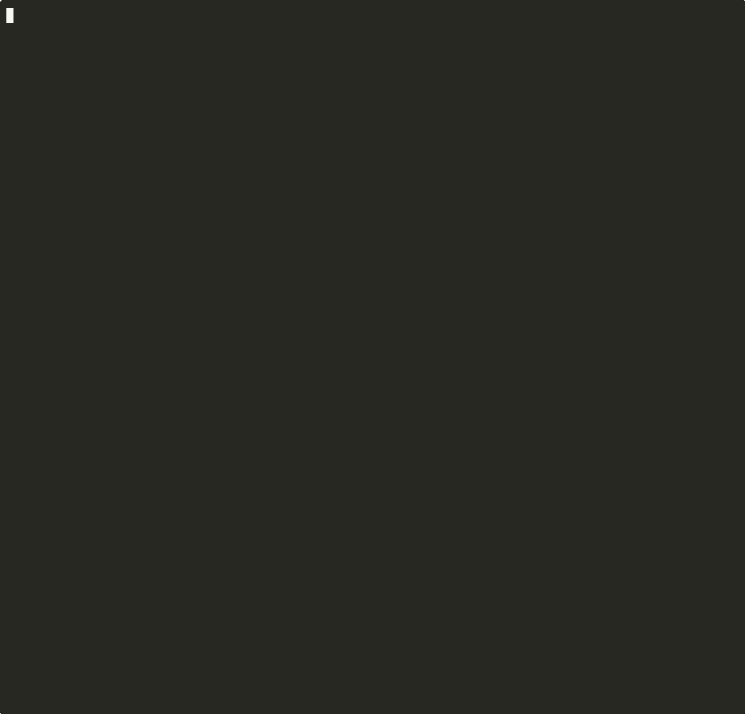

# mf-storefront-demo

[](./LICENSE)
[](https://nodejs.org)
[](https://react.dev)
[](https://webpack.js.org)
[](https://www.npmjs.com/package/@mf-toolkit/shared-inspector)

> Tracks `@mf-toolkit/shared-inspector` `^0.6.0`. v0.6.0 adds a **deep-import bypass detector** (subpath imports of shared packages, e.g. `react-dom/client`), MF 2.0 `mf-manifest.json` ingestion, and an extended singleton-risk list (zustand, jotai, recoil, react-redux, @tanstack/react-query, swr, @apollo/client, urql). Scenarios 1, 5 and 6 — fully aligned at 0.5.x — now surface a real React 18 / SSR / runtime-library deep-import concern that 0.5.x couldn't see. The "healthy" baselines in this demo are deliberately **not** further refactored: the new finding *is* the new feature working as designed.

A demonstration repository for [@mf-toolkit](https://github.com/zvitaly7/mf-toolkit). Six real-world microfrontend scenarios — healthy, drifted, federation-broken, critically misconfigured, a runtime integration via [`@mf-toolkit/mf-bridge`](https://github.com/zvitaly7/mf-toolkit/tree/main/packages/mf-bridge), and an SSR integration via [`@mf-toolkit/mf-ssr`](https://github.com/zvitaly7/mf-toolkit/tree/main/packages/mf-ssr) — all in one branch, runnable with a single command.

```bash
git clone https://github.com/zvitaly7/mf-storefront-demo
cd mf-storefront-demo
npm install
bash demo.sh
```

---

## Architecture

Three independent React 18 applications composed via Webpack Module Federation:

| App | Role | Key dependencies |
|---|---|---|
| **shell** | Host / orchestrator | React 18, React Router 6, Zustand 4 |
| **catalog** | Remote — product listing | React 18, React Router 6, Lodash 4 |
| **checkout** | Remote — cart & payment | React 18, React Router 6, Zustand 4 |

Each app is isolated: its own `package.json`, `tsconfig.json`, webpack config, and `shared-config.json` for the inspector. No cross-app local imports.

```
mf-storefront-demo/
├── scenarios/
│   ├── 1-healthy/           ← all configs aligned, federation 100, per-app 80 (0.6.0 deep-import baseline)
│   │   └── apps/{shell,catalog,checkout}/
│   │       ├── src/
│   │       ├── shared-config.json   ← MF shared declarations for inspector
│   │       └── webpack.config.js
│   ├── 2-drift/             ← config decay: catalog 40/100, checkout 64/100, federation 52/100
│   │   └── apps/{shell,catalog,checkout}/
│   ├── 3-federation-issues/ ← per-app 72–80, federation 89 (singleton mismatch + ghost share)
│   │   └── apps/{shell,catalog,checkout}/
│   ├── 4-critical/          ← everything wrong: every per-app score 0/100
│   │   └── apps/{shell,catalog,checkout}/
│   ├── 5-mf-bridge/         ← healthy federation, wired via @mf-toolkit/mf-bridge
│   │   └── apps/{shell,catalog,checkout}/
│   └── 6-mf-ssr/            ← SSR fragments + client hydration via @mf-toolkit/mf-ssr
│       └── apps/
│           ├── shell/src/     ← <MFBridgeSSR> (loader + url mode)
│           ├── catalog/src/   ← Loader-Mode remote (exposes component)
│           └── checkout/
│               ├── src/       ← client bundle (Cart + hydrate.ts)
│               └── server/    ← fragment handler for Node/edge/workers
├── scripts/
│   ├── federation-gate.ts   ← CI score gate
│   └── ssr-demo.mts         ← live mf-ssr capability demo (10 cases)
├── demo.sh                  ← runs all scenarios end-to-end
└── package.json
```

---

## Running the Demo

```bash
# All four scenarios + depth comparison + CI gate
bash demo.sh

# Focus on one scenario
bash demo.sh --scenario 2

# Compare one app across all scenarios
bash demo.sh --app catalog

# Barrel pattern depth comparison only
bash demo.sh --depth

# CI gate demonstration only
bash demo.sh --ci-gate

# mf-bridge integration diff only
bash demo.sh --bridge

# mf-ssr live capability demo only
bash demo.sh --ssr
```

Or via npm:

```bash
npm run demo
npm run demo:drift
npm run demo:federation
npm run demo:bridge
npm run demo:ssr
```

---

## Scenarios

### Scenario 1 — Healthy Baseline

All shared configs properly aligned. Versions match, singletons declared, no drift.


> Shell, catalog and checkout declare matching versions with correct `singleton` and `eager`
> flags. Federation analysis finds no cross-MF conflicts. Per-app score lands at 80/100 — the
> remaining 20 points come from a single 0.6.0 finding: `react-dom/client` is a subpath of the
> shared `react-dom`, so each MF technically bundles its own copy of the React 18 client entry.
> This is a real concern in MF 1.x + React 18 setups and the cleanest "healthy" the demo can be
> without exotic workarounds; see [Deep-Import Bypass Detector](#deep-import-bypass-detector-new-in-v060) below.

```
shell      Score: 80/100   🟡 GOOD       — Deep Import Bypass: react-dom/client
catalog    Score: 80/100   🟡 GOOD       — Deep Import Bypass: react-dom/client
checkout   Score: 80/100   🟡 GOOD       — Deep Import Bypass: react-dom/client
federation Score: 100/100  ✅ HEALTHY    — No federation-level issues found.
```

---

### Scenario 2 — Configuration Drift

Two drift problems introduced surgically. Each is invisible at runtime until something breaks.



> **catalog** declares `react@17.0.2` while the host runs `react@18.3.1` — a leftover from a
> React upgrade that was never propagated to the shared config. **checkout** adds `eager: true`
> to `react-router-dom` without `singleton: true` — a classic remote-initialises-the-router-first
> bug. Both are invisible at runtime until they crash. Under 0.6.0 each app also picks up the
> baseline `react-dom/client` deep-import finding from scenario 1.

```
catalog    Score: 40/100  🟠 RISKY
  ⚠ Version Mismatch — react       (configured: 17.0.2 | installed: 18.3.1)
  ⚠ Version Mismatch — react-dom   (configured: 17.0.2 | installed: 18.3.1)
  ⚠ Deep Import Bypass — react-dom (subpath: react-dom/client)

checkout   Score: 64/100  🟠 RISKY
  ⚠ Singleton Risk     — react-router-dom (singleton: true is missing)
  ⚠ Eager Risk         — react-router-dom (eager: true without singleton: true)
  ⚠ Deep Import Bypass — react-dom        (subpath: react-dom/client)

federation Score: 52/100  🟠 RISKY
  ⚠ Version Conflict   — react       (catalog 17.0.2 ≠ shell/checkout 18.3.1)
  ⚠ Version Conflict   — react-dom   (catalog 17.0.2 ≠ shell/checkout 18.3.1)
  ⚠ Singleton Mismatch — react-router-dom (singleton in shell/catalog, not checkout)
```

**What this demonstrates:** A stale `shared-config.json` where someone declared `requiredVersion: "17.0.2"` after a React upgrade that was never propagated. The inspector catches it at build time, before a runtime "Invalid hook call" in production.

---

### Scenario 3 — Federation Issues

Per-app scores look fine on the surface (under 0.5.x they were a clean 100/100 each). Federation analysis reveals two hidden cross-MF problems — singleton mismatch on zustand and ghost share on lodash. Under 0.6.0 the singleton mismatch also bubbles up *per-app* in checkout.


> Federation analysis runs across all three manifests and finds two hidden problems:
> **zustand** is shared as `singleton` in shell but not in checkout, so each app gets its own
> store and auth state never reaches the cart. **lodash** is declared as shared only by shell
> but catalog uses it unshared — shell pays the negotiation cost, catalog free-rides. Under
> 0.6.0 the singleton mismatch on zustand also surfaces *per-app* in checkout (zustand was
> added to the singleton-risk list), and every app picks up the baseline `react-dom/client`
> deep-import finding.

```
shell      Score: 80/100   🟡 GOOD     — Deep Import Bypass: react-dom/client
catalog    Score: 80/100   🟡 GOOD     — Deep Import Bypass: react-dom/client
checkout   Score: 72/100   🟡 GOOD     — Deep Import Bypass + Singleton Risk on zustand
federation Score: 89/100   🟡 GOOD

Federation analysis:
  ⚠ Singleton Mismatch — zustand
     singleton in: [shell]
     not singleton in: [checkout]

  ✗ Ghost Share — lodash
     shared only by: shell
     used unshared by: [catalog]
```

**What this demonstrates:** Per-app tooling gives you a false sense of safety. The zustand singleton mismatch (`singleton: true` in shell, absent in checkout) means shell and checkout run separate Zustand stores — auth state doesn't reach the cart. The lodash ghost share means shell pays the cost of sharing a library only it benefits from. Neither issue appears in per-app scores.

---

### Scenario 4 — Critical: Everything Wrong

All three apps are catastrophically misconfigured. React, React Router, and Zustand are all declared with stale major versions against what's actually installed. Catalog and checkout compound this with singleton/eager risks on the router.


> A shared config copied from a React 16 / Router 5 / Zustand 3 project and dropped into a
> React 18 stack with no updates. Every package is a version mismatch. Catalog stacks a
> singleton gap and an eager risk on top of that, plus declares zustand it never imports.
> All three apps now bottom out at 0/100 under 0.6.0 — the critical version-mismatch wall
> already saturated the score, and the new deep-import bypass detector adds yet another
> high-severity finding to each. The CI gate demo shows this whole federation failing the
> `--min-score 90` threshold.

```
shell      Score: 0/100    🔴 CRITICAL
  ✗ Version Mismatch × 4 (react, react-dom, react-router-dom, zustand)
  ⚠ Deep Import Bypass — react-dom (react-dom/client)

catalog    Score: 0/100    🔴 CRITICAL
  ✗ Version Mismatch × 4 (react, react-dom, react-router-dom, zustand)
  ✗ Unused Shared — zustand (in config, never imported)
  ⚠ Singleton Risk + Eager Risk — react-router-dom
  ⚠ Deep Import Bypass — react-dom (react-dom/client)

checkout   Score: 0/100    🔴 CRITICAL
  ✗ Version Mismatch × 4 (react, react-dom, react-router-dom, zustand)
  ⚠ Singleton Risk + Eager Risk — react-router-dom
  ⚠ Deep Import Bypass — react-dom (react-dom/client)

federation Score: 92/100   ✅ HEALTHY  — Singleton Mismatch on react-router-dom only
```

**What this demonstrates:** The floor. This is what happens when a team copies an old shared config from a React 16 / React Router 5 / Zustand 3 project into a React 18 stack without updating anything. The CI gate section shows how `federation-gate.ts --min-score 90` catches this before it ships.

---

### Scenario 5 — MF Bridge Integration

A healthy federation wired through [`@mf-toolkit/mf-bridge`](https://github.com/zvitaly7/mf-toolkit/tree/main/packages/mf-bridge) instead of raw `React.lazy` + `Suspense`. The bridge lives at the runtime layer, not the build layer — the federation analysis stays at 100/100. The per-app scores drop below 100 only because of the new 0.6.0 deep-import detector flagging the bridge's own `@mf-toolkit/mf-bridge/entry` subpath alongside the React 18 `react-dom/client` baseline.

> The remotes expose a single `./entry` returning a typed `register` factory produced by
> `createMFEntry`. The shell mounts each remote with `<MFBridgeLazy>`, which owns the
> loading state, retries, error fallback, and typed prop streaming. The cart state
> lives in the shell and is streamed to checkout as props; every change dispatches
> a `CustomEvent` on the mount element and the remote re-renders. Checkout emits
> `orderPlaced` via `emit()` — the shell picks it up through `onEvent` and navigates
> to `/confirmation`. The shell can also send commands into the remote through
> `commandRef` (`cmdRef.current('reset')`).

```
remote  catalog/src/entry.ts    export const register = createMFEntry(ProductList)
remote  checkout/src/entry.ts   export const register = createMFEntry(Cart, ({emit,onCommand}) => …)

host    shell/src/features/Checkout.tsx
          <MFBridgeLazy
            register={() => import('checkout/entry').then(m => m.register)}
            props={{ userId, items, onRemove, onClear }}   ← streamed via CustomEvent on change
            fallback={…}  errorFallback={…}                ← no Suspense / error boundary needed
            retryCount={2} retryDelay={500}
            onEvent={(type, payload) => …}                 ← remote → host events
            commandRef={cmdRef}                            ← host → remote commands
          />
```

**What this demonstrates:** the same federation, minus the boilerplate — and with a cleaner state story. The bridge replaces per-remote `React.lazy` wrappers, ad-hoc error boundaries, manual retry logic, hand-rolled global emitters (`window.*`), and the untyped `declare module 'catalog/ProductList'` stubs with a single typed mount component. Shell-internal state (auth, cart) drops from `zustand` to `React.createContext` + `useReducer` because no remote consumes it — this in turn removes the would-be "ghost share" the inspector would otherwise flag at the federation level. `@mf-toolkit/mf-bridge` is itself declared `singleton: true` in every app's shared config.

```
shell      Score: 80/100   🟡 GOOD     — Deep Import Bypass: react-dom/client
catalog    Score: 60/100   🟠 RISKY    — Deep Import Bypass × 2: react-dom/client + @mf-toolkit/mf-bridge/entry
checkout   Score: 60/100   🟠 RISKY    — Deep Import Bypass × 2: react-dom/client + @mf-toolkit/mf-bridge/entry
federation Score: 100/100  ✅ HEALTHY
```

> The two deep-import findings are 0.6.0 telling on the integration honestly: the bridge ships
> a separate `@mf-toolkit/mf-bridge/entry` subpath for `createMFEntry` that the remotes use,
> while the shared declaration only covers the root package. Same root cause as `react-dom/client`
> — the standard production fix is to either declare the subpaths shared explicitly or stop
> using subpath imports. Federation analysis is unaffected because the singleton-mismatch and
> ghost-share rules operate on root packages.

#### How the inspector caught two real issues during this integration

The clean federation score above is the *destination*, not the starting point. The first pass of the scenario-5 refactor — `createMFEntry` in both remotes, `MFBridgeLazy` in the shell, checkout rewritten as a pure-rendering component — compiled fine and looked correct. Running the inspector against it told a different story:

```
[MfSharedInspector] federation analysis (3 MFs)
────────────────────────────────────────────────────────────

→  Host Gap — @mf-toolkit/mf-bridge
   used by: [catalog, checkout, shell], not in shared config
   → Risk: Each MF bundles its own copy — larger bundles, possible state desync
   💡 Fix:
   shared: {
     @mf-toolkit/mf-bridge: { singleton: true }
   }

✗  Ghost Share — zustand
   shared only by: shell
   unused by all other MFs
   → One-sided coupling with no federation benefit
   💡 Fix: Remove "zustand" from shell's shared config

Score: 89/100  🟡 GOOD
```

Both are **real federation problems** the type-checker and webpack build can't see:

- **Host Gap — `@mf-toolkit/mf-bridge`.** Every MF imports the bridge; no MF declares it shared. Each remote would ship its own copy of the bridge code, and the prop-streaming path relies on host and remote operating on the same `DOMEventBus` implementation on the shared mount element. Different copies → different event-name namespacing, cross-bundle mount points drifting apart, subtle prop-update bugs in production.
- **Ghost Share — `zustand`.** Refactoring `checkout` to be a pure-rendering remote removed its zustand dependency, leaving `shell` the only MF declaring `zustand` as shared — and the only MF using it. Shell paid the shared-module negotiation cost for a library with no other consumers.

The fixes applied to get federation to a clean 100/100 (the per-app deep-import findings are a separate 0.6.0 concern, covered above):

| Issue | Fix |
|---|---|
| Host Gap on `@mf-toolkit/mf-bridge` | Declared `{ singleton: true }` in all three apps' `shared-config.json` + `webpack.config.js` |
| Ghost Share on `zustand` | Dropped zustand from `shell` entirely — shell's auth/cart state moved to `React.createContext` + `useReducer` (state is shell-internal and streamed into checkout as props, so no cross-MF store is needed) |

> **Why this matters for the demo.** Scenarios 1–4 stage misconfigurations deliberately. Scenario 5's two findings were *not* planted — they emerged organically while integrating a new runtime library, and the build-time inspector caught them before any of it shipped. This is the everyday case for `shared-inspector`: it's a lint for the federation layer that catches mistakes the compiler can't.

---

### Scenario 6 — MF SSR Integration

The same storefront, but the remotes are rendered **server-side** into streaming HTML with [`@mf-toolkit/mf-ssr`](https://github.com/zvitaly7/mf-toolkit/tree/main/packages/mf-ssr). The shell composes two modes side by side:

- **Loader Mode** (`catalog`) — host imports the remote component through Module Federation and server-renders it inline. One roundtrip.
- **URL Mode** (`checkout`) — remote exposes a Web-standard fragment endpoint (`createMFReactFragment`) on Node/Cloudflare/Vercel/Bun; shell fetches its pre-rendered HTML during SSR and keeps it alive post-hydration through `DOMEventBus` prop streaming.

```
remote  catalog/src/entry.ts        export { ProductList }          ← raw component for Loader Mode
remote  checkout/server/fragment.ts createMFReactFragment(Cart, {…}) ← Web fetch handler
remote  checkout/src/hydrate.ts     hydrateWithBridge(Cart, {ns:'checkout'})

host    shell/src/server.tsx        renderToReadableStream(<App/>)   ← edge-native streaming SSR
host    shell/src/features/Catalog.tsx
          <MFBridgeSSR loader={…}   props={{ products, onAddToCart }} />
host    shell/src/features/Checkout.tsx
          <MFBridgeSSR url="…"      namespace="checkout"
                        props={{ userId, items }}
                        cacheKey={userId}
                        fetchOptions={{ headers: { authorization } }}
                        onEvent={typedHandler}
                        commandRef={cmdRef} />
```

**Live demo** — a real Node script exercises ten mf-ssr capabilities against the actual fragment handler, no dev server, no browser required:

```bash
bash demo.sh --ssr    # or: npm run demo:ssr
```


It prints:

1. **Basic handler invocation** — status, headers, full HTML body (≈ 728 B for a populated cart)
2. **Streaming body** — `ReadableStream` chunks with offsets; `<Suspense>`-gated remotes flush their shells first
3. **Props in `?props=`** — URL-encoded JSON decoded server-side, rendered into HTML, also inlined as `<script data-mf-props>` for hydration matching
4. **Cache-Control + Vary** — three configurations side by side (`no-store` default, `public, s-maxage=60, stale-while-revalidate=30 + Vary: Accept-Language`, `private, max-age=0`)
5. **Error path** — malformed `?props=` lands on the component's empty-state branch with status 200; missing `?props=` likewise — no 500s leaking out of the handler
6. **Parallel composition** — three fragments in `Promise.all` vs sequential, wall-time delta printed
7. **Payload comparison** — client-only empty mount (31 B, empty until JS loads) vs SSR fragment (full rendered cart on first paint)
8. **Runtime portability** — the handler is `(Request) => Promise<Response>`; same file plugs into `node:http`, Hono, Next.js route handler, Cloudflare Worker, Bun.serve
9. **Hydration contract** — actual wire format emitted by the handler + the matching `hydrateWithBridge(Cart, { namespace })` on the client, with annotations for each step
10. **`cacheKey` / `preloadFragment` / `clearFragmentCache`** — per-user cache slots for auth-bound fragments, pre-warming on hover, cache eviction on logout

**Architectural choice on sharing.** Scenario 6 is a polyrepo split: only React, ReactDOM, and React Router are federation-shared. `@mf-toolkit/mf-ssr` is used only by the shell's client bundle and `@mf-toolkit/mf-bridge` only by checkout's hydration entry — neither is declared `shared: singleton`, so each MF bundles its own copy. This is correct: `DOMEventBus` dispatches via `CustomEvent` on the DOM (native, cross-bundle) and the fragment handler lives in `checkout/server/` outside the webpack MF scope entirely. Federation analysis is clean.

```
shell      Score: 60/100   🟠 RISKY    — Deep Import Bypass × 2: react-dom (client+server) + react-router-dom/server
catalog    Score: 80/100   🟡 GOOD     — Deep Import Bypass: react-dom/client
checkout   Score: 80/100   🟡 GOOD     — Deep Import Bypass: react-dom/client
federation Score: 100/100  ✅ HEALTHY
```

> The shell scores lowest of any scenario in the demo for one reason: streaming SSR. `server.tsx`
> uses `react-dom/server`'s `renderToReadableStream`, and the route layer uses
> `react-router-dom/server`'s `StaticRouterProvider`. Both are subpath imports of root packages
> the shell already shares — exactly the pattern the new 0.6.0 detector is designed to flag.
> In production a polyrepo SSR setup would either declare the `/server` subpaths shared
> alongside the roots, or accept the duplication (server bundles aren't subject to the same
> cross-MF concerns as the client). The demo leaves it visible so the new detector has something
> SSR-shaped to point at.

**What this demonstrates:** `shared-inspector` + `mf-bridge` catch build-time and client-runtime concerns. `mf-ssr` adds the **first-paint** layer — actual rendered HTML reaches the browser before JS loads, measured in real bytes here, not hand-waving. The three packages compose: the same remote can be rendered by mf-ssr server-side and kept interactive by mf-bridge client-side, and the shared-inspector keeps the federation configuration honest through all of it.

---

## Depth Analysis — Barrel Pattern

The `catalog` app is structured so that `lodash` is never imported directly in component files:

```
ProductList.tsx
  └── import { sortProducts, formatPrice } from './utils'   ← barrel
        └── utils/index.ts  re-exports from utils/format.ts
              └── utils/format.ts  imports from './vendor'  ← local re-export
                    └── utils/vendor.ts
                          └── export { chunk, orderBy } from 'lodash'  ← re-export
```

Run the inspector with both depth modes on the healthy scenario to see the difference:

```bash
# --depth direct: regex scan only — re-exports skipped → lodash invisible
mf-inspector --source scenarios/1-healthy/apps/catalog/src \
             --shared scenarios/1-healthy/apps/catalog/shared-config.json \
             --depth direct

# --depth local-graph (default): follows re-exports → lodash surfaced
mf-inspector --source scenarios/1-healthy/apps/catalog/src \
             --shared scenarios/1-healthy/apps/catalog/shared-config.json \
             --depth local-graph
```

Or run the comparison in one command:

```bash
bash demo.sh --depth
```

The `resolvedPackages` in the generated manifests differ:

| Mode | resolvedPackages |
|------|-----------------|
| `--depth direct` | react, react-dom, react-router-dom |
| `--depth local-graph` | react, react-dom, react-router-dom, **lodash** |

> In the healthy scenario lodash is not in the built-in share-candidates list so the score stays at the 0.6.0 baseline either way. Switch to scenario 3 to see the ghost share detected at federation level — the federation analyzer sees catalog's lodash usage (surfaced by local-graph) and flags that shell alone is paying the sharing cost.

---

## Deep-Import Bypass Detector (new in v0.6.0)

The depth analysis above asks **"does the inspector see this package at all?"** The deep-import detector asks the inverse: **"is this shared package being used through a subpath that bypasses the MF shared scope?"**

When a remote does

```ts
import cloneDeep from 'lodash/cloneDeep';   // subpath
```

while declaring only

```jsonc
{ "lodash": { "singleton": true } }         // root package
```

webpack's Module Federation runtime intercepts the *root* `lodash` resolution but **not** the subpath one — every MF ends up with its own copy of `lodash/cloneDeep` in its bundle. Same root cause for the React 18 entry (`react-dom/client`), the SSR entries (`react-dom/server`, `react-router-dom/server`), and runtime libraries that ship secondary entrypoints (`@mf-toolkit/mf-bridge/entry`).

This detector is what drops scenarios 1, 5 and 6 below 100/100 in this demo. The findings are real: in the demo's source tree

| Scenario | App | Subpath flagged | Reason |
|---|---|---|---|
| 1, 2, 3 (all) | shell, catalog, checkout | `react-dom/client` | React 18 client entry — `createRoot`, `hydrateRoot` |
| 5 | catalog, checkout | `@mf-toolkit/mf-bridge/entry` | bridge's `createMFEntry` factory |
| 6 | shell | `react-dom/client`, `react-dom/server`, `react-router-dom/server` | streaming SSR + router static provider |

The default allowlist is permissive only for the JSX runtime (`react/jsx-runtime`, `react/jsx-dev-runtime`) — those are emitted by the compiler, not by user code, so they're never a misconfiguration. Everything else surfaces by design. In production the standard fixes are: declare the subpath shared explicitly alongside the root, or refactor to a root-only import where the API allows it.

---

## CI Gate

```bash
# Healthy baseline at the 0.6.0 deep-import-aware threshold (must pass)
ts-node scripts/federation-gate.ts --scenario 1 --min-score 80

# Drift scenario fails (catalog: 40, checkout: 64 — both below 80)
ts-node scripts/federation-gate.ts --scenario 2 --min-score 80

# Critical scenario fails hard (shell/catalog/checkout: 0/100)
ts-node scripts/federation-gate.ts --scenario 4 --min-score 80

# Strict gate — fails scenario 1 because of the react-dom/client deep-import
ts-node scripts/federation-gate.ts --scenario 1 --min-score 90
```

Or via demo.sh:

```bash
bash demo.sh --ci-gate
```

---

## How the Simulation Works

Each `scenarios/N/apps/APP/` directory is a self-contained microfrontend project — the same structure you'd find in a real team's repository:

```
apps/shell/
├── src/                     ← React components, stores, utils
├── public/index.html        ← HTML template for HtmlWebpackPlugin
├── webpack.config.js        ← ModuleFederationPlugin with shared declarations
├── shared-config.json       ← mirror of the webpack shared block (inspector input)
├── package.json             ← app dependencies at the version this app targets
└── tsconfig.json
```

**`shared-config.json` is a demo artefact, not a real project file.** In a real project the shared declarations live only inside `webpack.config.js` — there is no separate JSON. The inspector has two integration paths:

| Integration | How it works | `shared-config.json` needed? |
|---|---|---|
| **Webpack plugin** | reads the `shared` block directly from `ModuleFederationPlugin` at build time | ✗ no |
| **CLI `--shared`** | reads a hand-maintained JSON that mirrors the webpack `shared` block | ✓ yes |

This demo uses the CLI path. Each app's `shared-config.json` is manually kept in sync with the corresponding `webpack.config.js` — that relationship is the point: when they drift apart, the inspector catches it. In production the plugin integration removes the need to maintain that file entirely.

**How version resolution actually works.** The inspector reads installed versions from `node_modules` adjacent to the `package.json` in the working directory — not from the `--source` path. In this demo `demo.sh` runs from the repo root, so all apps resolve to the root `node_modules` (React 18, Router 6, Zustand 4). The per-app `package.json` files inside each scenario directory are documentation — they show what version that app *targets*, but the inspector never reads them directly.

The drift is always introduced on the *declared* side: `requiredVersion` in `shared-config.json` is set to an old version while the installed package in root `node_modules` is the new one. This models the most common real-world drift: a team upgrades their dependency but forgets to update the webpack `shared` block.

In a real per-repo setup a team would run `mf-inspector` from their own repo root, where their own `package.json` and `node_modules` live. The inspector would then compare their `shared-config.json` against whatever they actually have installed — the same logic, just scoped to their repo.

**Bootstrap pattern.** All apps use the two-file async bootstrap that Module Federation requires:

```
src/index.tsx      → import('./bootstrap')          ← dynamic import, not static
src/bootstrap.tsx  → ReactDOM.createRoot(…).render  ← actual startup
```

The dynamic import is not optional — it gives webpack the chance to negotiate shared modules before any code runs. Skipping it is one of the most common MF bugs in the wild.

**TypeScript.** The shell app includes `declarations.d.ts` with explicit types for each federated module (`catalog/ProductList`, `checkout/Cart`). Without this TypeScript would refuse to compile the lazy remote imports. In a real setup these declarations are often auto-generated by the `@module-federation/typescript` plugin or kept manually in a shared types package.

---

## Related

- [@mf-toolkit/shared-inspector](https://github.com/zvitaly7/mf-toolkit/tree/main/packages/shared-inspector) — build-time shared-config linter (scenarios 1–4)
- [@mf-toolkit/mf-bridge](https://github.com/zvitaly7/mf-toolkit/tree/main/packages/mf-bridge) — runtime mount/lifecycle/events for MF remotes (scenario 5)
- [@mf-toolkit/mf-ssr](https://github.com/zvitaly7/mf-toolkit/tree/main/packages/mf-ssr) — SSR fragments, streaming composition, edge-native (scenario 6)
- [mf-toolkit](https://github.com/zvitaly7/mf-toolkit) — the full toolkit

## License

MIT
