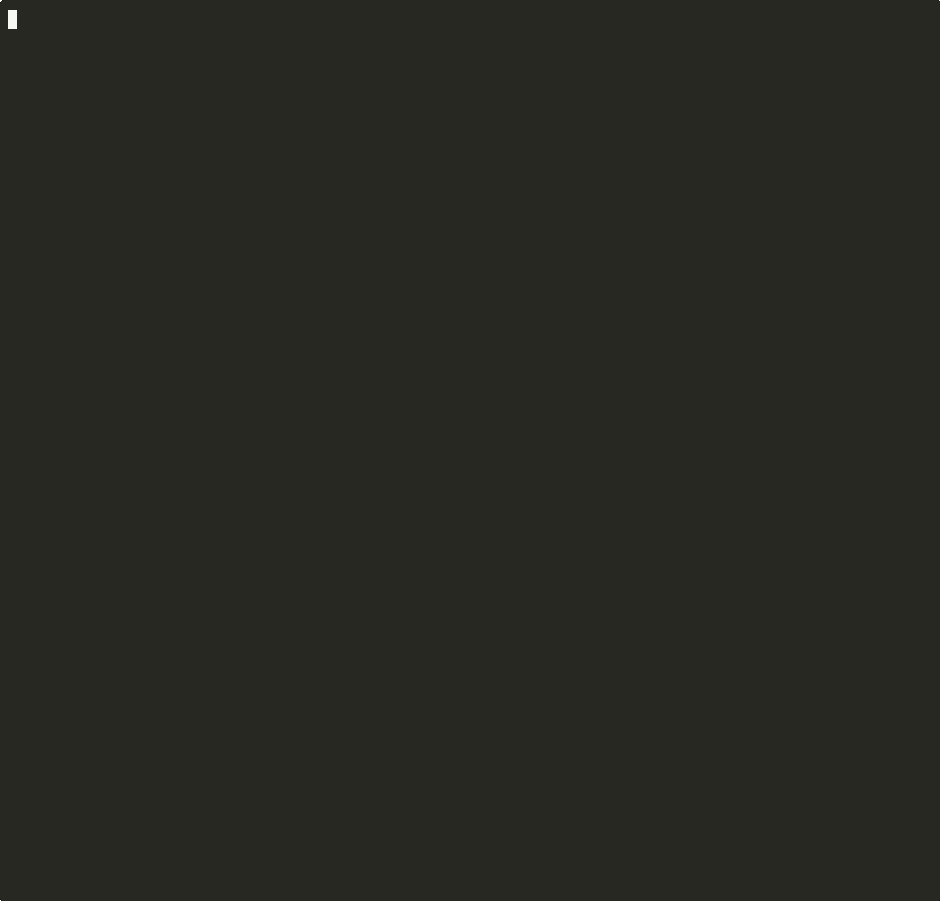

# mf-storefront-demo

[](./LICENSE)
[](https://nodejs.org)
[](https://react.dev)
[](https://webpack.js.org)
[](https://www.npmjs.com/package/@mf-toolkit/shared-inspector)

A demonstration repository for [@mf-toolkit/shared-inspector](https://github.com/zvitaly7/mf-toolkit/tree/main/packages/shared-inspector). Four real-world microfrontend scenarios — healthy, drifted, federation-broken, and critically misconfigured — all in one branch, runnable with a single command.



```bash
git clone https://github.com/zvitaly7/mf-storefront-demo
cd mf-storefront-demo
npm install
bash demo.sh
```

---

## Architecture

Three independent React 18 applications composed via Webpack Module Federation:

| App | Role | Key dependencies |
|---|---|---|
| **shell** | Host / orchestrator | React 18, React Router 6, Zustand 4 |
| **catalog** | Remote — product listing | React 18, React Router 6, Lodash 4 |
| **checkout** | Remote — cart & payment | React 18, React Router 6, Zustand 4 |

Each app is isolated: its own `package.json`, `tsconfig.json`, webpack config, and `shared-config.json` for the inspector. No cross-app local imports.

```
mf-storefront-demo/
├── scenarios/
│   ├── 1-healthy/           ← all configs aligned, scores 100/100/100
│   │   └── apps/{shell,catalog,checkout}/
│   │       ├── src/
│   │       ├── shared-config.json   ← MF shared declarations for inspector
│   │       └── webpack.config.js
│   ├── 2-drift/             ← config decay: catalog 60/100, checkout 84/100
│   │   └── apps/{shell,catalog,checkout}/
│   ├── 3-federation-issues/ ← per-app 100/100, federation reveals hidden issues
│   │   └── apps/{shell,catalog,checkout}/
│   └── 4-critical/          ← everything wrong: shell 20, catalog 1, checkout 4
│       └── apps/{shell,catalog,checkout}/
├── scripts/
│   └── federation-gate.ts   ← CI score gate
├── demo.sh                  ← runs all scenarios end-to-end
└── package.json
```

---

## Running the Demo

```bash
# All four scenarios + depth comparison + CI gate
bash demo.sh

# Focus on one scenario
bash demo.sh --scenario 2

# Compare one app across all scenarios
bash demo.sh --app catalog

# Barrel pattern depth comparison only
bash demo.sh --depth

# CI gate demonstration only
bash demo.sh --ci-gate
```

Or via npm:

```bash
npm run demo
npm run demo:drift
npm run demo:federation
```

---

## Four Scenarios

### Scenario 1 — Healthy Baseline

All shared configs properly aligned. Versions match, singletons declared, no drift.

```
shell    Score: 100/100  ✅ HEALTHY
catalog  Score: 100/100  ✅ HEALTHY
checkout Score: 100/100  ✅ HEALTHY
federation Score: 100/100  ✅ HEALTHY — No federation-level issues found.
```

---

### Scenario 2 — Configuration Drift

Two drift problems introduced surgically. Each is invisible at runtime until something breaks.

```
catalog  Score: 60/100  🟠 RISKY
  ⚠ Version Mismatch — react     (configured: 17.0.2 | installed: 18.3.1)
  ⚠ Version Mismatch — react-dom (configured: 17.0.2 | installed: 18.3.1)

checkout Score: 84/100  🟡 GOOD
  ⚠ Singleton Risk — react-router-dom (singleton: true is missing)
  ⚠ Eager Risk     — react-router-dom (eager: true without singleton: true)
```

**What this demonstrates:** A stale `shared-config.json` where someone declared `requiredVersion: "17.0.2"` after a React upgrade that was never propagated. The inspector catches it at build time, before a runtime "Invalid hook call" in production.

---

### Scenario 3 — Federation Issues

All three apps score 100/100 per-app. Federation analysis reveals two hidden cross-MF problems.

```
shell    Score: 100/100  ✅ HEALTHY
catalog  Score: 100/100  ✅ HEALTHY
checkout Score: 100/100  ✅ HEALTHY

Federation analysis:
  ⚠ Singleton Mismatch — zustand
     singleton in: [shell]
     not singleton in: [checkout]

  ✗ Ghost Share — lodash
     shared only by: shell
     used unshared by: [catalog]
```

**What this demonstrates:** Per-app tooling gives you a false sense of safety. The zustand singleton mismatch (`singleton: true` in shell, absent in checkout) means shell and checkout run separate Zustand stores — auth state doesn't reach the cart. The lodash ghost share means shell pays the cost of sharing a library only it benefits from. Neither issue appears in per-app scores.

---

### Scenario 4 — Critical: Everything Wrong

All three apps are catastrophically misconfigured. React, React Router, and Zustand are all declared with stale major versions against what's actually installed. Catalog and checkout compound this with singleton/eager risks on the router.

```
shell    Score: 20/100   🔴 CRITICAL
  ✗ Version Mismatch — react            (configured: 16.14.0 | installed: 18.3.1)
  ✗ Version Mismatch — react-dom        (configured: 16.14.0 | installed: 18.3.1)
  ✗ Version Mismatch — react-router-dom (configured: 5.3.4   | installed: 6.22.3)
  ✗ Version Mismatch — zustand          (configured: 3.7.2   | installed: 4.5.2)

catalog  Score: 1/100    🔴 CRITICAL
  ✗ Version Mismatch × 4 (react, react-dom, react-router-dom, zustand)
  ⚠ Singleton Risk + Eager Risk — react-router-dom
  ✗ Unused Shared — zustand (in config, never imported)

checkout Score: 4/100    🔴 CRITICAL
  ✗ Version Mismatch × 4 (react, react-dom, react-router-dom, zustand)
  ⚠ Singleton Risk + Eager Risk — react-router-dom
```

**What this demonstrates:** The floor. This is what happens when a team copies an old shared config from a React 16 / React Router 5 / Zustand 3 project into a React 18 stack without updating anything. The CI gate section shows how `federation-gate.ts --min-score 90` catches this before it ships.

---

## Depth Analysis — Barrel Pattern

The `catalog` app is structured so that `lodash` is never imported directly in component files:

```
ProductList.tsx
  └── import { sortProducts, formatPrice } from './utils'   ← barrel
        └── utils/index.ts  re-exports from utils/format.ts
              └── utils/format.ts  imports from './vendor'  ← local re-export
                    └── utils/vendor.ts
                          └── export { chunk, orderBy } from 'lodash'  ← re-export
```

Run the inspector with both depth modes on the healthy scenario to see the difference:

```bash
# --depth direct: regex scan only — re-exports skipped → lodash invisible
mf-inspector --source scenarios/1-healthy/apps/catalog/src \
             --shared scenarios/1-healthy/apps/catalog/shared-config.json \
             --depth direct

# --depth local-graph (default): follows re-exports → lodash surfaced
mf-inspector --source scenarios/1-healthy/apps/catalog/src \
             --shared scenarios/1-healthy/apps/catalog/shared-config.json \
             --depth local-graph
```

Or run the comparison in one command:

```bash
bash demo.sh --depth
```

The `resolvedPackages` in the generated manifests differ:

| Mode | resolvedPackages |
|------|-----------------|
| `--depth direct` | react, react-dom, react-router-dom |
| `--depth local-graph` | react, react-dom, react-router-dom, **lodash** |

> In the healthy scenario lodash is not in the built-in share-candidates list so the score stays 100 either way. Switch to scenario 3 to see the ghost share detected at federation level — the federation analyzer sees catalog's lodash usage (surfaced by local-graph) and flags that shell alone is paying the sharing cost.

---

## CI Gate

```bash
# Healthy baseline must pass (threshold 90)
ts-node scripts/federation-gate.ts --scenario 1

# Drift scenario will fail (catalog: 60, checkout: 84 — both below 90)
ts-node scripts/federation-gate.ts --scenario 2

# Critical scenario fails hard (shell: 20, catalog: 1, checkout: 4)
ts-node scripts/federation-gate.ts --scenario 4

# Custom threshold
ts-node scripts/federation-gate.ts --scenario 1 --min-score 100
```

Or via demo.sh:

```bash
bash demo.sh --ci-gate
```

---

## How the Simulation Works

Each `scenarios/N/apps/APP/` directory is a self-contained microfrontend project — the same structure you'd find in a real team's repository:

```
apps/shell/
├── src/                     ← React components, stores, utils
├── public/index.html        ← HTML template for HtmlWebpackPlugin
├── webpack.config.js        ← ModuleFederationPlugin with shared declarations
├── shared-config.json       ← mirror of the webpack shared block (inspector input)
├── package.json             ← app dependencies at the version this app targets
└── tsconfig.json
```

**`shared-config.json` is a demo artefact, not a real project file.** In a real project the shared declarations live only inside `webpack.config.js` — there is no separate JSON. The inspector has two integration paths:

| Integration | How it works | `shared-config.json` needed? |
|---|---|---|
| **Webpack plugin** | reads the `shared` block directly from `ModuleFederationPlugin` at build time | ✗ no |
| **CLI `--shared`** | reads a hand-maintained JSON that mirrors the webpack `shared` block | ✓ yes |

This demo uses the CLI path. Each app's `shared-config.json` is manually kept in sync with the corresponding `webpack.config.js` — that relationship is the point: when they drift apart, the inspector catches it. In production the plugin integration removes the need to maintain that file entirely.

**Why a single `node_modules` instead of per-app installs?** The inspector resolves "installed version" by walking up from the source directory to the nearest `node_modules`. In this demo all apps resolve to the root install (React 18, Router 6, Zustand 4). This is the same result you would get if each app ran the inspector from its own directory in a workspace — the installed version is whatever is on disk. The drift is always introduced on the *declared* side (`requiredVersion` in shared-config or webpack), not by actually downgrading a package, which keeps the demo runnable with a single `npm install`.

**Bootstrap pattern.** All apps use the two-file async bootstrap that Module Federation requires:

```
src/index.tsx      → import('./bootstrap')          ← dynamic import, not static
src/bootstrap.tsx  → ReactDOM.createRoot(…).render  ← actual startup
```

The dynamic import is not optional — it gives webpack the chance to negotiate shared modules before any code runs. Skipping it is one of the most common MF bugs in the wild.

**TypeScript.** The shell app includes `declarations.d.ts` with explicit types for each federated module (`catalog/ProductList`, `checkout/Cart`). Without this TypeScript would refuse to compile the lazy remote imports. In a real setup these declarations are often auto-generated by the `@module-federation/typescript` plugin or kept manually in a shared types package.

---

## Related

- [@mf-toolkit/shared-inspector](https://github.com/zvitaly7/mf-toolkit/tree/main/packages/shared-inspector) — the tool this demo is built for
- [mf-toolkit](https://github.com/zvitaly7/mf-toolkit) — the full toolkit

## License

MIT
